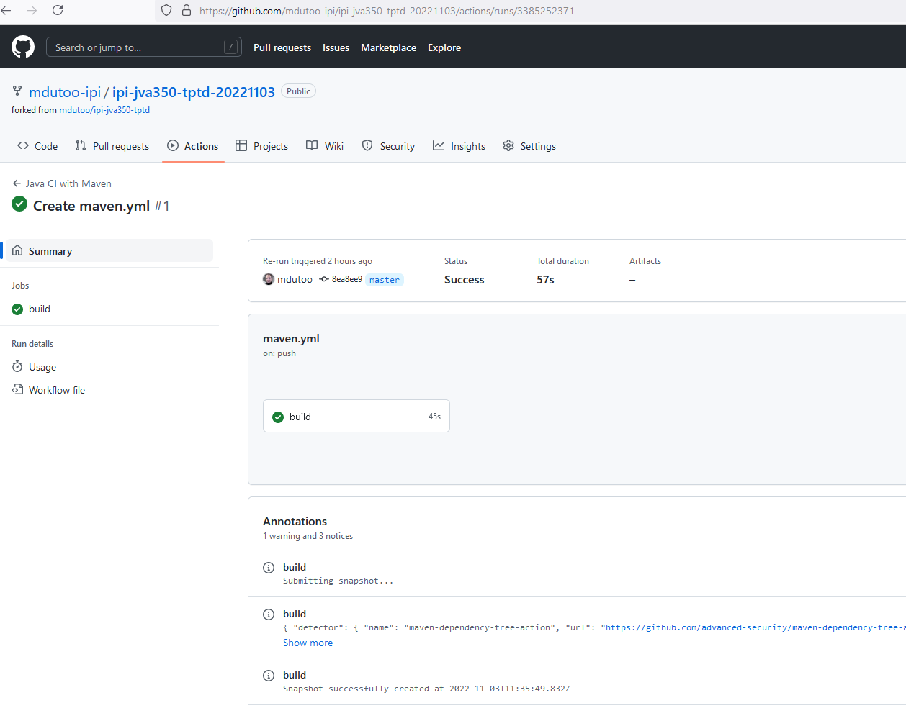
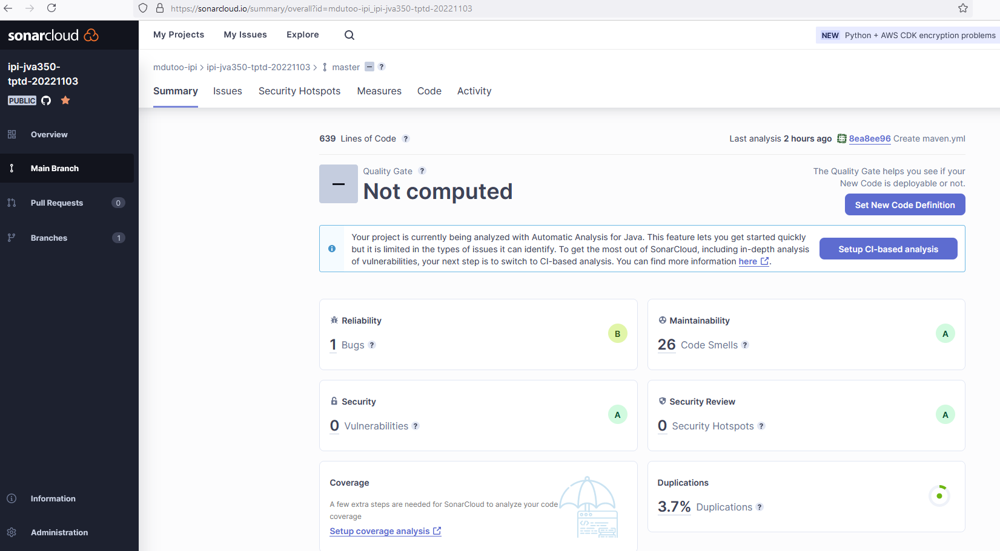
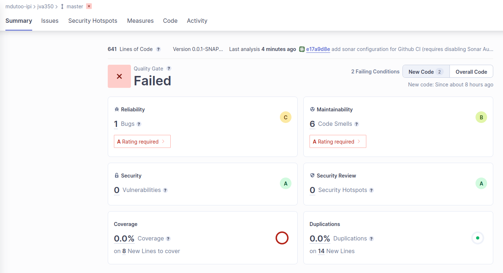

<style>

section {
  background-color: #fefefe;
  color: #333;
  font-size: 28px;
}

img[alt~="center"] {
  display: block;
  margin: 0 auto;
}
blockquote {
  background: #ffedcc;
  border-left: 10px solid #d1bf9d;
  margin: 1.5em 10px;
  padding: 0.5em 10px;
}
blockquote:before{
  content: unset;
}
blockquote:after{
  content: unset;
}
</style>

<!-- _class: lead -->

# IPI - JVA350

## Qualité logicielle, test et intégration

&nbsp;

#### Marc Dutoo

---

## L'enseignant

- Marc Dutoo, architecte
  - 20 ans d'Open Source, Java, distribué, innovation
  - et plus récemment Data, Python...
  - https://www.linkedin.com/in/marcdutoo
  - https://www.slideshare.net/mdutoo
  - https://github.com/mdutoo
- Mes crédos pédagogiques :
  - pour tirer les bénéfices d'un outil, méthode ou approche, il faut comprendre comment cela marche ! et souvent d'où ça vient
  - des exemples concrets éclairants, tirés du monde réel
  - Pratiquez, pratiquez, pratiquez !

---

## Le cours

[
TODO évaluation ; td, tp ; et méthodologies ?
]::

Objectifs et compétences visés :

(**en gras**, les travaux pratiques en séance et évalués)

- Qualité logicielle - *concepts et méthodologies de développement*
- Outils et pratiques - *plateformes **CI** et **qualité***
- Fiabilité - *tests unitaires et d'intégration **(Junit), métriques***
- Capacité fonctionnelle - *tests d'**acceptation**, d'interface et manuels, métriques*
- Performances - *tests de performance et métriques*
- Maintenabilité - *journalisation (**logback**), documentation (**javadoc, mkdocs**), livraison*

& dates, évaluation et retours

---

<!-- _class: lead -->

# La qualité logicielle

---

## L'industrie logicielle : révolution... et crise

La révolution logicielle : fabriquer un nouveau produit ne nécessite plus une nouvelle usine... mais simplement des heures d'ingénieur (vous !)

Ce potentiel a été perçu et de très gros projets se sont lancés d'abord aux USA dans les années 70 et 80, qui ont fini par être pour la plupart des échecs catastrophiques :
- les retards s'accumulent
- les dépassements des coûts prévisionnels aussi
- et ce qui est livré, quand il l'est, se révèle défectueux (anomalies techniques),
- ou ne correspond pas aux besoins du client,
- ou... n'y correspond plus, car les délais ont été tels que les besoins ont nécessairement évolué entre temps !
- et une fois fini, ce n'est pas mieux pour les évolutions ou les réutilisations ailleurs.

---

## L'industrie logicielle - 2

[NOTES : C'était trop facile...  Mais de grands pouvoir impliquent de grandes responsabilités]::

mais finalement il est logique que lorsqu'il est possible de produire des ordres de grandeurs davantage, les méthodes d'ingéniérie traditionelle alors utilisés ne suffisent plus, et qu'il faille beaucoup mieux maîtriser le processus.

- La clé de cette maîtrise : l'**adéquation aux besoins**, en les formalisant et **testant**.
  - la méthode de développement en **cascade** (Waterfall, plus tard raffinée en **cycle en V**), a résolu la crise en figeant les spécifications détaillées validées par le client **avant** le développement.
  - la leçon de cette crise : plus on lève les problèmes **tard**, plus ils sont **difficiles** voire impossible à corriger et à refaire marcher comme l'attend l'implémenteur, le spécifieur et les autres parties du programme, le client et l'utilisateur
- depuis, on a compris qu'inversement : plus les problèmes sont détectés **rapidement**, plus ils sont **faciles** à corriger
  - au coeur des méthode (XP, agile, Scrum...) et techniques (CI) plus récentes

[
si on ne teste pas, et au plus vite, ça devient vite très cher voire impossible à faire marcher (que ça marche comme l'attend l'implémenteur, le spécifieur et les autres parties du programme, le client et l'utilisateur) plus tard
]::

---

## La qualité logicielle - de quoi parle-t-on ?

Il s'agit de qualité du produit et des processus
- du produit :
  - ce qui est attendu
  - fiable, fournissant les fonctionnalités attendues, performant, maintenable, facile d'usage, portable
- des processus :
  - comment il est produit
  - dans les coûts et délais impartis, processus de montée en compétence, d'exploitation et de livraison, gestion et qualité
    
Evaluée de manière mesurable : par des indicateurs, **mesurés** !

[
De quoi parle-t-on ? / Définition
]::

[
TODO :
Crise etage d'intégration car gros,donc boucle de retours la plus courte possible, vrai agile est conception de la réponse aux besoins itérative, donc éviter sauf prototype ou contraint en temps et non périmètre,  Reformuler au client, mix processus, de nombreux logiciels tels firefox ne montrent plus la version a l'utilisateur et s'installent de suite : permis grâce à intégration continue, sans on fait comme Windows qui mettait avant des années
Reproductible donc raz, gros donc simple, traçable donc ci, indépendant si pertinent et test base
]::

---

## La qualité logicielle, ça ne fait pas rêver ?

De prime abord, quand on apprend le développement, la qualité logicielle et les tests n'en sont souvent pas l'aspect préféré :
- ennuyeux
- une source de déconvenues (les bugs découverts)
- prend trop de temps, au dépens du développement
- vivement la livraison, après moi le déluge !
- si de toutes façons, le client n'est jamais content, et l'utilisateur ne sait jamais se servir du logiciel
- s'il y a des testeurs, ce n'est pas aux développeurs de tester

---

## La qualité logicielle, ça fait rêver !

[NOTES : un programme qui marche du premier coup, c'est un programme dont on ne sait pas qu'il ne marche pas, et à quel point
dans quelques mois aux prochaines corrections ou évolutions ce sera de nouveau vous, et comme alors tout vous sera sorti de l'esprit, mieux vaut tout avoir laissé dans le meilleur état !
le test, c'est comme la documentation du code, le premier utilisateur et bénéficiaire ce sera vous !
Junit comme "driver" de test]::

- ennuyeux => l'intégration continue (CI) la "gamifie" (métriques, "cup of coffee")
- des déconvenues => autre raison de les découvrir **plus tôt**, ils seront **plus petits** !
- trop de temps => un test Junit est toujours la manière **la plus simple de lancer son programme** en le développant ! profiter alors des erreurs rencontrées pour les mettre en vérifications. Et tester peut même être le point d'entrée du développement (TDD) ou être utile en phase de conception technique !
- après moi le déluge => à la prochaine évolution ce sera souvent **de nouveau vous** !
- satisfaction client => **BDD** et **ATDD** la contrôlent ! plus largement, autant avoir balisé le plus finement possible ce qu'on leur fournit, ça fait ça en moins d'inconnu 
- s'il y a des testeurs, ce n'est pas aux développeurs de tester => un développeur qui n'exécute par son programme n'est oas un développeur ; et voir le point 3.

[
Mais que nous apprend la crise logicielle des années 80 ?
TODO - et encore au-délà : de nombreux aspects de la qualité confirme 
]::

---

## Outils et pratiques

- Outils :
  - outil de build et packaging, documentation du code, technique et produit
  - framework(s) de test, serveur d'intégration continue
  - plateforme de mesure de la qualité, détection statique, style de code...
  - plateforme(s) de gestion des problèmes techniques et client
  - plateforme de gestion des itérations (milestones)
- Pratiques :
  - Pair programming, revues de code, refactoring
  - standard et règles de code, voire conception
  - Implication des développeurs dans les chiffrages
  - Implication du client
  - Rétrospectives
    

---


<!-- _class: lead -->

# La gestion de projet

---

## Méthodologie de développement : le cycle en V

- un flux d'activités **strictement** descendant, qui détaille le produit jusqu'à sa réalisation,
- un flux ascendant, qui assemble le produit en vérifiant sa qualité, dans des activités **validant** en miroir celles du flux descendant.


Source : https://fr.wikipedia.org/wiki/Cycle_en_V

---

## Méthodologie de développement : XP

En quelque sorte, Extreme Programming (XP) a fait descendre le cycle en V et ses principes dans une unité beaucoup plus fine et **agile** : l'**itération** de développement.


Source : https://en.wikipedia.org/wiki/Extreme_programming

---

## Extreme Programming (XP) - Pratiques

Mais surtout, XP l'a accompagné de nombre de pratiques depuis reprises universellement par les méthodes dites "agiles" :
- livraisons (releases) : petites **itérations**, aux fonctionnalités planifiées par maturité et priorité. Typique des méthodes agiles, le développement itératif vise à obtenir des retours rapides du client afin d'éviter au maximum l'**effet tunnel**.
- test : tout, tout le temps (Intégration Continue), et même dès le début (voir TDD) revues de code, jusqu'au *pair programming*
- disponibilité du client
  - concept de **User Story** : "a User Story is the promise of a conversation"
- code : simplicité, refactoring (amélioration continue de la conception), clarté, standards et conventions de codage

---

## Extreme Programming (XP) - User story

Une User Story est une manière de définir une fonctionnalité unitaire qui soit implémentable et surtout validable.

La forme standard d'une User Story dans les méthodologies agiles est la suivante :
- titre
- histoire (narrative) : "en tant que *utilisateur connecté de ce site de e-commerce*, je veux *un bouton d'achat en un clic*, pour que *je puisse réaliser un achat le plus vite possible*" (as a, I want, so that)
- critère d'acceptation, découpé et formalisé en les étapes : **"Given", "When", "Then"** (Etant donné, quand, alors)
  - => ce découpage est réutilisé dans les **tests unitaires**

---

## Méthodologie de développement : Scrum


Source : https://bubbleplan.net/pedagogie-projet/methode-scrum

La plus populaire des méthodes agiles, la méthode Scrum reprend les principes de XP mais, pour facilité et garantir leur bonne mise en oeuvre, les codifie beaucoup plus et attache de l'importance à leur mise en scène (**rites**).

---

## Scrum - bases

Les rôles (pas de chef de projet au sens traditionnel) :
- Le Product Owner (PO) : garant fonctionnel, responsable du "backlog" du produit (fonctionnalités à développer)
- Le Scrum Master : garant du respect de la méthode Scrum et des cérémonies
- Une équipe stable de ~8 personnes

Les étapes :
- Planning de "sprint" : après un "Energizer", le PO présente les User Story mûres /
prêtes, échanges dans l'équipe, chiffrage, choix (= "backlog" du sprint)
  - Definition Of Ready (DoR) : une User Story est complète (prête à être implémentée) quand elle valide le critère INVEST (Independant, Negotiable, Valuable, Estimable, Small, Testable)

---

## Scrum - étapes

- Le sprint (itération, ~3 semaines, figées) : développement, avancement visualisé
  - dans un tableau Kanban : une colonne par étape TODO / WIP (Work In Progress) / VALIDATE / DONE où avancent les items
- Le daily meeting : synchronisation entre l'équipe (une fois l'avancement à jour)
- Definition Of Done : critères à vérifier pour que le développement d'une User Story soit finie
  - comment ça fait ce que ça fait (le code développé) != ça le fait bien (tests unitaires) et != c'est ce qu'il faut (tests d'Acceptation)
  - y compris Revues de code (par le biais de Pull Request)...
- Revue de sprint : permet d'obtenir les retours des parties prenantes, et valider l'objectif du sprint
- Rétrospective : identifier les points d'amélioration, en tirer des actions à prendre

---

## Méthodes agiles et qualité

- Attention, quelque soit la méthodologie (ou les pratiques) suivie, la suivre à la lettre ne suffit pas !
  - et ce même pour Scrum et sa rigoureuse codification
  - (ou seulement à l'entreprise d'être sûre que ses développeurs suivent bien une méthodologie)
- pour en obtenir les bénéfices, encore faut-il qu'elle soit bien appliquée dans son esprit.
  - "Cargo cult" : les rites ne font pas les miracles

[
high-quality testing, which involves helping to link testing to development and to business goals. This is at the core of Behaviour Driven Development (BDD), to encourage the collaboration between the business, developers, and tester.
=> Unit tests should be written in order of business value ((ex dans un e-commerce, le chemin critique de l'achat : recherche, ajout panier, commande, paiement)), with acceptance testing being written using the standard agile framework, i.e. a user story using the classes ‘Given’, ‘When’, and ‘Then’.
]::

[
automate happy path tests that cover these high-value scenarios, even a little broader
suppl : prioriser valeur et risque (code très utilisé, intégrant ou utilisant système complexe...)
TODO MOVE The first layer should be very simple and fast-running tests for problems that prevent you from doing useful testing and development on whatever piece of functional￾ity you’re working on, ex db
]::


---

<!-- _class: lead -->

# Fiabilité

---

## Fiabilité

Un code fiable est un code sans bug ! C'est le premier niveau de la qualité logicielle.

- Automatisation : Serveur d'intégration continue
- Evaluation : Plateforme de suivi de la qualité
- Tests unitaires
- Test Driven Development (TDD)
- Junit
- Tests d'intégration
- Métriques de fiabilité logicielle

---

## Intégration continue - principe

- l'intégration continue (CI) a pour but est de détecter tout défaut le plus tôt possible
  - ce qui est clé pour garantir une certaine qualité, comme vu
  - popularisé par Kent Beck dans la méthode de développement Extreme Programming (XP) après son expérience chez Chrysler
- par l'**automatisation** un maximum de tests, en général lancés lors de l'arrivée d'un nouveau commit
- à mettre en place **dès le début** du développement, car c'est alors plus facile d'y rendre les développeurs "accrocs" (gamification : "cup of coffee"...)

[
Ci vient de Kent Beck 1999 XP
Getting a team addicted to automated testing is simpler to achieve if you start at the beginning of a project, gamification
]::

---

## Intégration continue - bénéfices

- sans l'intégration continue, vos développements ne marchent pas jusqu'à ce que quelqu'un prouve le contraire !
- elle permet de résoudre par exemple les problèmes classiques
  - du développeur à qui un autre reproche d'avoir "cassé" le code, et qui répond que non "ça marche chez moi" !
  - de l'oubli du commit d'un nouveau fichier
  - lancez quand même les tests en local avant de committer ;)
- Solutions :
  - serveur : [Jenkins](https://jenkins.io/) (répandu en Java), Gitlab CI
  - Cloud : [Travis](http://travis-ci.org/) pour Github (simple, intégré, [supporte Java](https://docs.travis-ci.com/user/languages/java/)), Gitlab Cloud

[
Without continuous inte￾gration, your software is broken until somebody proves it works
Why run locally first:
Other people may have checked in before your last update from version control, and the combination of your new changes and theirs might cause tests to fail. If you check out and run the commit tests locally, you will
identify this problem without breaking the build.
& A common source of errors on check-in is to forget to add some new artifact
TODO et avec branches, PRs, sonar aussi, ? ne jamais casser le build ou alors le réparer de suite donc prendre de la marge
]::

---

## Intégration continue - en pratique

Détail d'un run réussi d'un workflow de build avec Maven dans Github Actions :



En cliquant sur le nom du workflow (ici "build"), on peut accéder au détail de son déroulement dans le run, dont les messages de maven durant le build.

[
binaries/github%20actions_all_workflows_3_runs.png
]::

---

## Evaluation : Suivi de la qualité

- il ne suffit pas d'automatiser les tests, il faut encore voir ce que leurs résultats veulent dire, et en tirer un maximum en le combinant à des métriques
  - d'évolution de ces résultats,
  - d'analyse statique du code : couverture, complexité, "code smells" (code sâle)...
- [Sonar](https://about.sonarcloud.io/) est la plateforme la plus répandue, disponible en Cloud ou à installer soi-même. Voici son tableau de bord en mode initial "automatic analysis" :



---

## Sonar - en pratique

Tableau Sonar de bord après configuration pour Github Actions :



---

## Les tests unitaires

[NOTES des tests non reproductibles, il y en a eu plein lors du passage à Java 7 ! Car alors la liste des méthode d'une classe retournée par introspection (java.lang.reflect), sur laquelle se basait l'ordre d'exécution par défaut dans Junit, n'était plus celui de leur code. Evidemment, ça voulait aussi dire qu'ils n'étaient pas non plus "indépendants"...
Sa conception peut être fautive => voir Acceptance, BDD, ATTD]::

Les tests unitaires sont écrits par les développeurs pour vérifer qu'une partie du programme se comporte comme sa conception l'a prévu. Leurs caractéristiques importantes sont :
- unitaire => il ne doit tester qu'une seule chose : ainsi son échec indique précisément le périmètre du problème
- indépendant => de même que ce qu'il teste est unitaire, comment il le teste doit être unitaire, donc séparé des autres tests
- simple => si comment il teste n'est pas aisément compréhensible, s'il échoue il sera plus dur de corriger et le refaire marcher
- clair => si ce qu'il teste n'est pas aisément compréhensible, son échec n'apportera pas beaucoup d'information
- reproductible => ne dépendant pas d'un état non reproductible, ou de concurrence ("race condition")
- rapide => on l'a vu ! des tests lents sont exécutés moins souvent, voire jamais. De plus cela ralentit les processus d'intégration continue (par exemple, versement automatique en branche "master" si les tests passent)

---

## Tests unitaires - bonnes pratiques - 1

Pour en tirer tous les bénéfices, les tests unitaires doivent être écrits :
- dans l'ordre de leur valeur ajoutée métier. Par exemple dans une plateforme de e-commerce, le chemin critique d'achat : recherche, ajout panier, commande, paiement.
- sous la forme standard dans les méthodologies agiles : les étapes **"Given", "When", "Then"** d'une User Story
- mettez l'accent sur l'automatisation des tests du chemin critique de ces scenarii à haute valeur ajoutée (voire même un peu plus largement)

---

## Tests unitaires - bonnes pratiques - 2

- Comme dit en parties précédentes, une haute qualité requiert de lier les activités de test
  - aux objectifs de développement : => la pratique du TDD (Test Driven Development)
  - et aux objectifs métier : => la pratique du BDD (Behaviour Driven Development, = TDD sur des tests d'acceptation)
- Faire une première couche de tests très simples et rapides pour des problèmes qui empêchent de faire des tests utiles et du développement de fonctionnalités, par exemple tester la connexion à la base de données

---

## Test Driven Development (TDD) - motivations

- C'est une bonne pratique coder les test unitaires **avant** le développement (TDD).
- Il a été prouvé (XP) que cela est nécessaire à une bonne couverture du code
  - laquelle est requise pour avoir des retours rapides, qui sont le premier but de l'intégration continue.
  - et qui permet du refactoring facile universellement, pratique clé d'un développement performant depuis XP
- quand commence le développement d'une nouvelle fonctionnalité ou correction,
  - le développeur code d'abord un test,
  - qui est une spécification exécutable de son comportement attendu.
  - Une fois développé, il sert de test de régression
  - et de documentation de son usage et fonctionnement prévu
  - le TDD peut même aider à la définition des classes d'implémentation (modèle, service), "en pochoir"

---

## Test Driven Development (TDD) - en pratique

- "définissez un test, faites-le échouer, implémentez, vérifiez-le !"
- comme vu :
  - un code pas exécuté ne marche pas,
  - un test unitaire est la plus facile manière de le lancer,
  - donc le TDD devrait être **toujours** employé dans une certaine mesure,
  - ...ou dès qu'on a un code assez complet pour s'exécuter
  - => déduction : **écrivez toujours des bouts de code pouvant être rapidement exécutables !**
    

---

<!-- _class: lead -->

# Fiabilité - Tests unitaires avec Junit

---

## Junit

- le plus connu des frameworks Open Source de tests unitaires Java
- par Erich Gamma (Design Patterns) et Kent Beck (Extreme Programming)

Fonctionnalités :
- joue le rôle de "driver" de tests (les lance),
- permet leur vérification (assertions),
- aide aussi à leur automatisation (par la CI) et suivi (ex. leurs rapports sont exploités par Sonar)

[
TODO image, ou avec le suivant ?
]::

---

## Tester, c'est :

- d'abord faire s'exécuter du code à tester, et ce dans un environnement contrôlé,
  - les tests sont du code ! donc des **méthodes de test** dans des **classes de test**
  - elles ont un nom dérivé de ce qu'ils testent, de même package mais sous le dossier **src/test/java**
- mais aussi vérifier que son exécution a été correcte (résultat ou état final conforme aux attentes).
  - par des **assertions**
  
---

## Code de test

Par exemple, pour tester com.secu.Patient.checkNumeroSecu() :

```java
package fr.secu;

// pas besoin d'importer Patient car il est dans le même package
import org.junit.jupiter.api.Test; // en Junit 4 : org.junit.Test
import static org.junit.jupiter.api.Assertions.*; // Junit 4 : org.junit.Assert.*

public class PatientTest {

@Test // indique que sera exécutée par Junit
public void testCheckNumeroSecuWrong() {
    // Given : Mise en place de l'environnement du test et de ses données (hypothèses)
    String numeroSecu = "XXXXXX";
    // When : Comportement à tester, en pratique une (ou des) méthode(s) à exécuter
    Boolean numeroSecuOk = Patient.checkNumeroSecu(numeroSecu);
    // Then : Comparaison du résultat de la méthode ou de l'état final avec celui attendu
    Assertions.assertEquals(false, numeroSecuOk);
}
```

---

## Assertions - Junit

Simples ("less is more"), message d'erreur (mieux qu'en commentaire)

```java
import static org.junit.jupiter.api.Assertions.*; // Junit 4 : org.junit.Assert.*
import org.assertj.core.api.Assertions;

public class PatientTest {
    @Test
    public void testCheckBadNumeroSecu() {
        ... // Given, When
        // Then - Junit :
        assertEquals("Message d'erreur visible dans les rapports", expected, actual); // assertNotEquals()
        // ou sans message :
        assertEquals(expected, actual); // assertNotEquals()
        assertSame(expected, actual); // même objet i.e. référence
        assertNull(actual);
        assertTrue(actualBoolean); // assertFalse()
        assertArrayEquals(expectedArray, actualArray);
```

Documentation : [org.junit.jupiter.api.Assertions](https://junit.org/junit5/docs/5.8.2/api/org.junit.jupiter.api/org/junit/jupiter/api/Assertions.html)

---

## Assertions - AssertJ

aussi acceptées par Junit, plus complètes et en appels chaînés (fluent)

```java
        // Then - AssertJ :
        Assertions.assertThat(actualBoolean).isTrue(); // isFalse
        Assertions.assertThat(actualObject).isNull(); // isNotNull
        Assertions.assertThat(actualObject).isEqualTo(expectedObject); // isNotEqualTo
        Assertions.assertThat(actualString).contains("expected string"); // doesNotContain(IgnoringCase)...
        Assertions.assertThat(actualString).startsWith("expected prefix"); // endsWith
        Assertions.assertThat(actualString).isEmpty(); // isNotEmpty
        Assertions.assertThat(actualNumber).isPositive(); // isNegative
        Assertions.assertThat(actualNumber).isGreaterThan(10); // isLessThan(OrEqualTo)
        Assertions.assertThat(actualList).hasSize(1);
```

Documentation : [https://assertj.github.io/doc/](https://assertj.github.io/doc/)

C'est une question de philosophie !

---

## Tester les levées d'exceptions - Junit4

Une solution classique (avec fail()), et une plus maligne :

```java
    // Given
    try{
        // When
        fail("Aurait dû lever WrongNumeroSecuException !") // Then
    } catch (WrongNumeroSecuException e) {
        assertTrue(true); // pas requis mais sinon pas d'assertion réussie dans le rapport !
    }
```

```java
@Test(expected = WrongNumeroSecuException.class)
public void testCheckNumeroSecuWrong() throws WrongNumeroSecuException {
    // Given, When, Then
```

---

## Tester les levées d'exceptions - 2

Junit5 :
```java
    // Given...
        WrongNumeroSecuException thrown = Assertions.assertThrows(ApplicationException.class, () -> {
        // When...code à tester
    });
    Assertions.assertEquals("Aurait dû lever WrongNumeroSecuException !", exception.getMessage());
```

AssertJ :
```java
    // Given...
    assertThatThrownBy(() -> { // ou assertThatExceptionOfType() similaire à Junit5
        // When...code à tester
    }).isInstanceOf(WrongNumeroSecuException.class)
        // Then
        .hasMessageContaining("Aurait dû lever");
```

---

## Junit avancé

- @MethodOrder, et utilité de @DisplayName
- @Disabled
- @Timeout
- @Tag : pour filtrer uniquement certains tests, par exemple liés à un composant externe ou plus largement d'intégration, et pouvoir ne les exécuter que dans un certain environnement

[
disabled & on os jre sysprop custom, testfactory, methodorder displayname, testinstance lifecycle, timeout souvent pas assez, tag to filter ex integration test (!) si nommage pas assez, suite, parameterresolver...
Filter maven surefire
]::

---

## Quelques pratiques

- lancer les tests : avant tout le faire dans votre IDE : Clic droit > Debug !
- Souvent quand un test échoue, pour le corriger il y a 2 options :
  - corriger le code, mais il faut le comprendre,
  - ou plus simple mais souvent faux : corriger la donnée !
  - c'est un rappel de la dualité de code et données
- il y a parfois besoin de partager la même configuration spécifique dans tous les tests d'intégration (exposant des services web, consommant des APIs externes...)
  - une solution est une classe de test abstraite héritée. Mais souvent copier les annotations n'est pas plus compliqué... A condition qu'elles ne changent pas !
- il peut être pertinent et efficace d'enchaîner plusieurs When / Then après un seul Given, par exemple pour tester les différentes étapes au cours d'un scenario. Mais attention à ne pas ainsi mélanger des tests qui sont en fait indépendants !

[
TODO !
  IntelliJ : CTRL-Maj-F10, ou l'universel Alt-Entrée
  Eclipse : Alt-Shift-D,J
Petite disgression, la dualité du code et des données : tout code est données (le fichier de code), mais de la donnée peut aussi être du code (fichier de configuration), et parfois les deux à la fois (XML exprimant des règles ex. XACML ou une interface graphique ex. React.js).
]::

---

## Tests paramétrés - avec Junit5

[
De la même manière qu'on paramétrise une méthode si on veut l'utiliser avec des valeurs différentes, de la même manière on peut utiliser des tests paramétrés si on a besoin de les vérifier sur plusieurs jeux de données différents.
]::

Les méthodes ont des paramètres ? Les tests peuvent aussi ! Utile par exemple pour tester des règles complexes avec de nombreux cas.

```java
@ParameterizedTest(name = "numeroSecu {0} est valide : {1}")
@CsvSource({
        "'XXXXXXXXXXXXXXX', false",
        "'277023523800522', true"
})
void testCheckBadNumeroSecu(String numeroSecu, Boolean expected) {
    // Given, When, Then
    Assertions.assertEquals(expected, Patient.checkNumeroSecu(numeroSecu));
}
```

---

## Avec Junit4, plus lourd :

```java
@Test(expected = WrongNumeroSecuException.class)
@RunWith(value = Parameterized.class) // org.junit.runners.Parameterized
public class PatientTest {
  @Parameter(value = 0) // org.junit.runners.Parameterized.Parameter
  public String numeroSecu;
  @Parameter(value = 1)
  public Boolean result;
  // org.junit.runners.Parameterized.Parameters
  @Parameters(name = "numeroSecu {0} est valide : {1}")
  public static Collection<Object[]> data() {
    return Arrays.asList(new Object[][]{
       {"XXXXXXXXXXXXXXX", false}, {"277023523800522", true}
    });
  }
  @Test
  public void testCheckBadNumeroSecu(){
    // Given, When, Then
    Assertions.assertEquals(expected, Patient.checkNumeroSecu(numeroSecu));
  }
```

---

## (Ré)Initialisation

- pour tester un composant unitairement, on va souvent **utiliser pour tous les tests d'une classe de test** un même état (données) qu'il faut donc mettre en place avant chacun,
  - typiquement pour en tester différents aspects ou attendus dans des méthodes de test différentes, et car créer des (bonnes !) données de test n'est jamais trivial (ni très agréable ou lisible). Ainsi chaque méthode sera un test bien "indépendant".
  - Pour la même raison il est très conseillé de remettre en place l'état de base **entre chaque test**.
- On peut aussi y mettre du code d'initialisation du système spécifique en environnement de test si Spring ne fait pas tout.

---

## (Ré)Initialisation - Junit 5

```java
public class PatientTest {
    @BeforeAll
    public void setUp(){ // // Nom différent possible
      // Appelée une seule fois avant tous les tests de la classe. Eexmple : du code
      // d'initialisation spécifique pour des tests si Spring ne fait pas tout.
    }
    @BeforeEach
    public void before(){ // Nom différent possible
        // Appelée avant chaque (méthode de) test. Exemple : (re)mettre en place des données
        // identiques avant chaque test
    }
    @AfterEach
    public void after(){ // Nom différent possible
        // Appelée après chaque (méthode de) test. Exemple : fermer proprement des ressources utilisées
    }
    @AfterAll
    public void tearDown(){ // Nom différent possible
        // Appelée une seule fois après tous les tests. Exemple : du code requis pour arrêter
        // "proprement" l'application en environnement de test
    }
}
```

---

## (Ré)Initialisation - Junit 4

```java
public class PatientTest {
  @BeforeClass
  public void setUp(){ // Nom différent possible
    // Appelée une seule fois avant tous les tests de la classe. Eexmple : du code
    // d'initialisation spécifique pour des tests si Spring ne fait pas tout.
  }
  @Before
  public void before(){ // Nom différent possible
    // Appelée avant chaque (méthode de) test. Exemple : (re)mettre en place des données
    // identiques avant chaque test
  }
  @After
  public void after(){ // Nom différent possible
    // Appelée après chaque (méthode de) test. Exemple : fermer proprement des ressources utilisées
  }
  @AfterClass
  public void tearDown(){ // Nom différent possible
    // Appelée une seule fois après tous les tests. Exemple : du code requis pour arrêter
    // "proprement" l'application en environnement de test
  }
}
```

---

## Mocker les composants non testés

[
Si dans un test le composant testé utilise d'autres composants, ce test n'est pas unitaire. Par conséquent, 
Mocks are an especially abused form of test doubles. It’s very easy to misuse mocks by writing tests that are both pointless and fragile, using them simply to assert the specific details of the workings of some code rather than its interactions with collaborators. Such usage is fragile because if the implementation changes, the test breaks. Examining the distinction between mocks
]::

- un test complètement unitaire ne doit pas utiliser l'implémentation réelle de ces autres composants, mais des implémentations de test ("stubs"). Des frameworks de mocking tel Mockito (fourni avec Spring) permettent d'en créer facilement dont les méthodes retournent des valeurs voulues ("mocks").
- attention à ne pas tester les détails d'implémentation d'un code, plutôt que ses intéractions avec d'autres composants, car c'en est un usage inapproprié qui produit des tests très fragiles. 
- voici un exemple où la méthode findByNumeroSecu() de PatientRepository est un mock dont le comportement est programmé pour retourner null quand on lui passe XXXXXXXXXXXXXXX :

---

## Mocks sous Junit 5

```java
@ExtendWith(MockitoExtension.class)
public class PatientServiceTest {

    @InjectMocks
    private PatientService patientService;
    @Mock
    private PatientRepository patientRepository;
    
    @Test
    public void testFindByNumeroSecuNotFound() {
        // Given
        Mockito.when(patientRepository.findByNumeroSecu("XXXXXXXXXXXXXXX")).thenReturn(null);
        // When
        EntityNotFoundException e = Assertions.assertThrows(EntityNotFoundException.class, () ->
                patientService.findByNumeroSecu("XXXXXXXXXXXXXXX")
        );
        // Then Exception
        Assertions.assertEquals(e.getMessage(), "Patient X non trouvé !");
    }
}
```

---

## Mocks sous Junit 4

```java
@RunWith(MockitoJUnitRunner.class)
public class PatientServiceTest {

    @InjectMocks
    private PatientService patientService;
    @Mock
    private PatientRepository patientRepository;

    @Test(expected = EntityNotFoundException.class)
    public void testFindByNumeroSecuNotFound(){
        // Given
        Mockito.when(patientRepository.findByNumeroSecu("XXXXXXXXXXXXXXX")).thenReturn(null);
        // When
        patientService.findByNumeroSecu("XXXXXXXXXXXXXXX");
        // Then Exception
    }
}
```

---

## Vérifier les comportements des mocks

- si les assertions doivent s'appliquer non à ce que retourne un mock mais à ce qui lui est passé, on en met en place la capture.
- par exemple ici, la capture du patient sauvé est utilisée pour le vérifier à la fin :

```java
public class PatientServiceTest {
    ...
    @Test
    public void testChangeMedecinTraitant() {
        // Given
        Patient patient = new Patient("277023523800522");
        Mockito.when(patientRepository.findOne(Mockito.anyLong())).thenReturn(patient);
        Mockito.when(patientRepository.save(Mockito.any(Patient.class)))
                .thenAnswer(AdditionalAnswers.returnsFirstArg());
        // When changeMedecinTraitant(idPatient, idMedecinTraitant)
        patientService.changeMedecinTraitant(1L, 2L);
        // Then
        ArgumentCaptor<Patient> patientCaptor = ArgumentCaptor.forClass(Patient.class);
        Mockito.verify(patientRepository, Mockito.times(1)).save(patientCaptor.capture()); // arg capture !
        Assertions.assertThat(patientCaptor.getValue().getMedecinTraitantId()).isEqualTo(2L);
    }
}
```

---

## Préparation spécifique - lancer Spring

- Pour pouvoir tester des classes instanciées par Spring (beans : services...), lancer le test unitaire doit lancer Spring.
- Spring fournit des aides pour le lancement et l'accès (injection par @Autowired) :

```java
@ExtendWith(SpringExtension.class) // Junit 4 : @RunWith(SpringRunner.class)
@DataJpaTest // ou carrément @SpringBootTest et sa configuration
public class PatientRepositoryTest {
  @Autowired
  PatientRepository patientRepository;
  @Test
  public void testFindByNumeroSecu(){
    ...
```

---
## Configuration et ressources de test

- le dossier **src/test/resources** se rajoute en tête du classpath et permet de surcharger la configuration quand il y a besoin qu'elle soit différente pour les tests.
- Par exemple, surcharger le configuration Spring pour préférer à PostgreSQL une base de données en mémoire :

```properties
# src/test/resources/application.properties :
spring.datasource.driver-class-name=org.h2.Driver
spring.datasource.url=jdbc:h2:mem:db;DB_CLOSE_DELAY=-1
spring.datasource.username=sa
spring.datasource.password=sa
```

---

<!-- _class: lead -->

# Fiabilité - Les tests d'intégration

---

## Les tests d'intégration

Leur but est tester ensemble les intéractions des différents composants du programme.
- Il n'est pas de refaire les tests qui doivent être faits unitairement, qui seront toujours plus rapides et précis et doivent donc être privilégiés
- ni de tester les résultats de chaque composant indépendamment.

Les qualités d'un test d'intégration sont :
- **rapidité** (toujours !)
- **indépendance** (des tests unitaires, et entre eux)
- **pertinence** (pratique et puissant mais ne pas en abuser, un test unitaire permettra toujours d'identifier un problème plus vite et plus précisément)

[
Dans les tests d'intégration, les différents composants du programme sont progressivement assemblés et testés ensemble.
Le but des tests d'intégration est de :
progressivement assembler et tester ensemble les différents composants
tester leurs intéractions
n'est pas de refaire les tests qui doivent être faits unitairement (à moins de partager une version unique du code de test ou "driver"), qui seront toujours plus rapides et précis
et donc n'est pas de tester les résultats de chaque composant indépendamment
]::

---

## Stratégies de tests d'intégration

- La stratégie la plus courue est d'assembler et tester progressivement depuis les parties vers l'ensemble ("bottom up").
- Si tout est déjà testé unitairement, un seul test global suffit parfois ("big bang").

Cela montre qu'entre test unitaire et d'intégration, la différence n'est pas noir ou blanc, mais progressive. Il peut être **pertinent** par exemple :
- de ne pas faire certains tests de manière pleinement unitaire dans le cas de mocks qui seraient complexes et fragiles.
- de partager une version unique ("driver") du code de test d'un scenario complexe entre un test unitaire et un test d'intégration
- de se demander "est-ce que ça en vaut la peine" ? i.e. selon quelle méthode, modulo sa rapidité de détection de problème, les gains en validité de périmètre dépassent-ils le coût de développement et maintenance ?

---

## Tests d'intégration sous JUnit

- Il s'agit encore de tests Junit, mais qui utilisent les vraies implémentations des composants (et donc aucun mock).
- Souvent les tests doivent donc charger le contexte Spring. C'est nettement plus lourd et lent (**rapidité** !) : il faut donc préférer les tests unitaires.

```java
@ExtendWith(SpringExtension.class) // Junit 4 : @RunWith(SpringRunner.class)
@SpringBootTest
public class PatientServiceTest {
    @Autowired
    public PatientService patientService;
    @Test
    public void test(){
        // Given : mise en place réelle de données d'entrées
        // When : appel des implémentations réelles des méthodes :
        patientService.changeMedecinTraitant(1L, 2L);
        // Then : assertions sur le vrai état du système
    }
}
```

---

## Métriques de fiabilité logicielle

Voici les plus importantes :
- % couverture de code (Code coverage)
  - question : que pensez-vous de vouloir viser 100% de couverture ? (indice : les
    faux positifs)
- % de tests unitaires et d'intégration réussis
- % complexité cyclomatique
  - i.e. en termes de cycles possibles : boucles, conditions...
- % de lignes de commentaires

[
TODO :
Intégration test - test harness that mock external system APRES
after unit test and before system test / fr "validation"
wikipedia : Substitutes such as method stubs, mock objects, fakes, and test harnesses can be used to assist testing a module in isolation.
]::


---

<!-- _class: lead -->

# Capacité fonctionnelle

---

## Capacité fonctionnelle

Si la fiabilité est que le logiciel marche comme l'attend son développeur ("comme il faut"), la capacité fonctionnelle est qu'il marche comme l'attend le client ("comme il le faut").

- Tests d'acceptation(Acceptance)
- Tests d'interface
- Tests manuels
- Métriques de capacité fonctionnelle

---

## Les tests d'acceptation (Acceptance)

- Les tests d'acceptation ont pour but de vérifier la conformité fonctionnelle de l'application, en spécifiant le besoin sous forme de **scenarii détaillés**.
  - il ne s'agit plus de la conformité technique !
  - ils doivent être précis !
  - validés (ou même mieux écrits) par le client, comme toute spécification !
- Comme pour les tests techniques, c'est une bonne pratique
  - de les automatiser
  - de les fournir avant le développement (Acceptance Test Driven Development, ATDD).
- attention, si son critère d'acceptation n'est pas bien défini, un test d'acceptation deviendra très difficilement maintenable !
  - un bon critère d'acceptation doit prouver que la valeur métier décrite est bien rendue à l'utilisateur
  - donc les testeurs doivent être impliqués dans la rédaction initiale des besoins

[
Blindly automating badly written acceptance criteria is one of the major causes of unmaintainable acceptance test suites. For each ac￾ceptance criterion you write, it should be possible to write an automated accep￾tance test proving that the value described is delivered to the user. This means that testers should be involved in writing requirements from the start
(AILLEURS? :)
automate happy path tests that cover these high-value scenarios, even a little broader
suppl : prioriser valeur et risque (code très utilisé, intégrant ou utilisant système complexe...)
The first layer should be very simple and fast-running tests for problems that prevent you from doing useful testing and development on whatever piece of functional￾ity you’re working on, ex db
]::

---

## Behaviour Driven Development (BDD) - principes

- Le principe du Behaviour Driven Development (BDD) est de tester les comportements attendus d'un composant d'un logiciel en en **formalisant** les scenarii spécifiés
  - du test de bonne qualité doit aider à lier le test au développement et aux objectifs métier. C'est dans cette optique que le BDD encourage la **collaboration** entre le métier, les développeurs et les testeurs.
- typiquement,
  - le scenarii est une User Story
  - et la formalisation est réalisés dans un langage de programmation dédié, ayant la caractéristique d'être aussi proche du **langage naturel** que possible, pour être lisible par les non techniques
- ou encore : BDD = TDD + acceptance en tant que user story formalisée

[
Todo autres guide: testing automation GitHub ci incl. Selenium ?
]::

---

## BDD - Frameworks

Citons les frameworks de BDD :
- Cucumber
  - suit le format traditionnel de la User Story
  - adapté s'il y a proximité de l'équipe et du projet avec Javascript et au format Gherkin
- Gauge
  - un peu plus flexible
  - adapté s'il y a proximité de l'équipe et du projet avec Java et Markdown

---

## BDD - Cucumber et Gherkin

- Gherkin est le parseur du langage de Cucumber
  - langage naturel pour les non techniques
- syntaxe :
  - Feature, découpée en
  - Scenario, découpé en
  - Step, qui permette de définir chaque "Given", chaque "When", chaque "Then"
- erreurs classiques :
  - écrit à la première personne (au lieu de la 3e),
  - précise chaque action à effectuer au lieu de décrire une fonctionnalité,
  - contient en statique ce qui devrait être configurable 

[
https://www.spritecloud.com/guides/cucumber-gherkin/
]::

---

## BDD - Gherkin : exemple d'une Feature

```gherkin
Title: Returns and exchanges go to inventory.

        As a store manager,
        I want to add items back to inventory when they are returned or exchanged,
        So that I can track inventory levels.

@scenario1
Scenario: Items returned for refund should be added to inventory.
        Given that a customer previously bought blue suede shoes from me
        And I have three blue suede shoes in inventory,
        When they return the blue suede shoes for a refund,
        Then I should have four blue suede shoes in inventory.
```

---

## Les tests d'interface

- Le but des tests d'interface est de vérifier le bon fonctionnement d'une interface graphique, en simulant le comportement de l'utilisateur.
  - le but n'est pas de tester le rendu graphique !
- il s'agit donc de tests fonctionnels / d'acceptation, écrits à l'aide de frameworks capables de piloter par exemple des navigateurs (plusieurs !) dans le cas d'IHM en technologie web
- attention, ils sont coûteux à développer, fragiles et difficile de maintenance !
  - => les réserver à ce qui n'est pas testable autrement et a une haute valeur métier (ex. e-commerce : achat en un seul clic...)
- quelques frameworks répandus :
  - Selenium
  - Taiko

[
http://igm.univ-mlv.fr/~dr/XPOSE2010/testinterfaceweb/presentation.html
]::

---

## Les tests d'interface - manuels

Les tests manuels sont coûteux, donc doivent autant que possible être évités par l'automatisation. Mais il en restera toujours,
- au moins lors d'événements importants :
  - nouveau pan fonctionnel, déploiement, ou s'il est automatisé changement du système de déploiement, ou première présentation au client ou aux utilisateurs...
  - et notamment en préparation de la **phase de recette** de l'application par le client
- en remplacement de tests automatisés trop coûteux à écrire ou maintenir et faire évoluer
- ils sont sujets à l'erreur humaine et donc doivent être **scénarisés**

---

## Métriques des tests d'acceptation

Les métriques importantes sont :
- % tests d'acceptation réussis
- % tests d'interface réussis
- % tests manuels réussis
- état de conformité vis-à-vis du cahier de recette
- nombre et taille de surprises ou incompréhensions exprimées par le client à la découverte du logiciel et en phase de recette !


---

<!-- _class: lead -->

# Performances

---

## Performances

Ce qu'est la performance d'une application varie en fonction de son type (site web, application métier, traitement de données asynchrône ou Big Data...).

- La bonne approche vis-à-vis des problèmes de performance
- Tests de charge
- Métriques de performance

---

## Tests de charge

- les tests de charges (Load Testing) permettent d'identifier les problèmes de performance, et de partir à la chasse des "goulots d'étranglement" à optimiser
- conseil : à commencer dès que du code critique pour la performance est développé
  - sinon, ça peut se révéler très coûteux de les résoudre à la fin !
- ils doivent être **réalistes** ! Typiquement pour une application web : en jouant dans un navigateur un scenario d'utilisation réaliste défini, scenario dont les requêtes web sont capturées par un proxy web, puis ensuite dupliqué pour chaque utilisateur à simuler par rajoût de directives de scripting autour
- Quelques outils de test de charge :
  - JMeter : IHM pratique autorisant un scripting facile
  - Gatling : plus "programmatique", ses captures de requêtes sont du Scala
  - The Grinder : ses captures sont du Jython, peut contrôler des agents

[
https://www.baeldung.com/gatling-jmeter-grinder-comparison
]::

---

## Exemple avec The Grinder - Architecture de test type


Source : https://grinder.sourceforge.net/g3/manual.html

---

## Exemple avec The Grinder - Courbe de montée en charge type


Source : https://grinder.sourceforge.net/g3/manual.html

---

## La bonne approche

- La bonne approche : avoir dès le début prévu une architecture et approche globale capable d'offrir les performances requises,
  - par exemple, une base de données sur laquelle on pourra dans des conditions réelles ou approchées rajouter des index afin d'optimiser les requêtes identifiées comme problématiques grâce à une analyse des "slowlogs"
  - ou une couche de service lourdement utilisée par des lectures massives (application web), couche qui peut être optimisée par l'ajoût de cache (de niveau 2 / L2 Cache)
- mais ensuite pas d'optimisation prématurée : il faut attendre de connaitre ou d'identifier goulot d'étranglement !
- inversement, attention à ne pas s'éloigner excessivement de cette approche de manière cachée au cours du développement. Par exemple, faire des calculs sur l'ensemble (!) des données de la base lors d'une écriture en base...
- éclairant : [interview du Java Champion Kirk Pepperdine](https://www.oracle.com/technical-resources/articles/javase/pepperdine-qa.html)

---

## Métriques de performance

Voici quelques mesures de performance importantes :
- Web
  - temps de chargement des pages
- Application
  - consommation mémoire, CPU (et disque pas plein !)
  - temps de chargement
- Application avec base de données
  - temps des recherches
  - temps des écritures, par exemple dans le cas de validation métier globale multi transactionnelle, ou appel de services web / APIs trop nombreux car trop granulaires


---

<!-- _class: lead -->

# Maintenabilité

---

## Maintenabilité

La maintenabilité d'une application ou d'un composant logiciel est sa capacité à être maintenu en état de fonctionnement et à évoluer fonctionnellement, et ce à moindre coûts et délais, tout en préservant sa cohérence.

- Documentation du code
- Journalisation
- Documentation projet
- Développements spécifiques
- Livraisons
- Métriques

---

## Documentation du code

- une bonne documentation du code est indispensable pour sa lisibilité et donc maintenabilité.
  - un code qui n'est pas documenté n'a pas été écrit pour des êtres humains. Or si le code est écrit avec des termes anglais plutôt que des 0 et des 1, ce n'est pas pour la machine, à qui les 0 et les 1 suffisent, mais bien pour les êtres humains !
  - là encore, votre premier lecteur sera sans doute vous-même !
- la documentation de code Java est faite :
  - sous forme de commentaires
  - et au format standard Javadoc, utilisé et fourni par les IDEs, outils de build (Maven : javadoc plugin)...

---

## Javadoc - exemple

```java
/**
 * Service de gestion des patients
 */
@Service
public class PatientService {
    /**
     * Change le médecin traitant d'un patient
     * @param patientId id du patient
     * @param medecinTraitantId son nouveau médecin traitant
     * @returns le statut du changement réalisé (encore en cours...)
     * @throws PatientException si le patient a déjà un médecin traitent en cours de changement
     * @since 0.5
     */
    public Status changeMedecinTraitant(long patientId, long medecinTraitantId) throws PatientException {
        ...
```

---

## Javadoc - production

pom.xml :

```xml
<build>
  <plugins>
    <plugin>
      <groupId>org.apache.maven.plugins</groupId>
      <artifactId>maven-javadoc-plugin</artifactId>
      <version>3.0.0</version>
      <configuration>
        <source>1.8</source>
        <target>1.8</target>
      </configuration>
    </plugin>
  </plugins>
</build>
```

```shell
mvn javadoc:javadoc
```

---

## Bons commentaires et code lisible

[NOTES passages complexes : mais encore une fois les déplacer dans leur propre méthode bien nommé peut en limiter, clarifier voire éviter la documentation ! Et en plus ça permettra leur test unitaire !]::

- comme ailleurs, "davantage" ne veut pas dire "mieux" !
  - en effet, le code fait partie de la documentation ! or un code lisible commencer par **bien nommer** variables, méthodes et classes (et bien les modéliser)
  - si c'est le cas, beaucoup de documentation peut devenir redondante. Dans l'exemple précédent, seul "**nouveau** médecin traitant" n'a pas déjà été donné.
- il faut documenter (en Javadoc ou commentaires) :
  - le lien avec les spécifications. Par exemple dans l'exemple précédent : "Service de gestion des patients" (qui en dehors de cela est redondant)
  - éclaircir les passages complexes, leur intention, leur approche
  - éclaircir les choix techniques / d'implémentation faits qui se sont pas documentés dans les spécifications techniques car trop ponctuels
  - et notamment la manière (et pourquoi) dont on se sert ou / et configure, pour un besoin précis, des librairies spécifiques et peu communes

---

## Journalisation

[NOTES Dit autrement, elle permet de comprendre ce qui se passe dans l'application en marche.]::

La journalisation (logging) est la consignation d'informations à propos de code exécuté par l'application.  Elle peut concerner
- des événements métier : erreurs fonctionnelles, actions utilisateur et informations à propos du client qu'il utilise, traitements planifiés
- ou techniques : erreurs techniques, seuils atteints

Tout code pouvant nécessiter du débogage et recherche de cause source (root cause) en production devrait s'accompagner de journalisation, afin de faciliter l'identification et la reproduction des problèmes remontés par les utilisateurs.

---

## Journalisation - en pratique

En pratique, La journalisation est
- réalisée avec l'aide de librairies dédiées (en Java : [Logback](https://dzone.com/articles/configuring-logback-with-spring-boot), Log4J), dans des fichiers mis en rotation
- collectée et analysée si nécessaire par des outils spécifiques : la stack ELK (ElasticSearch, Logback, Kibana), Splunk, syslog...

Voici les niveaux de log usuels, qui peuvent être activés ou non par configuration :
- DEBUG : réservé au développeur, aide au débogage
- INFO : information retraçant dez étapes du bon fonctionnement de l'application
- WARNING : alerte (seuils, cas suspicieux ou risqués...)
- ERROR : erreur caractérisée, technique ou métier
- FATAL : erreur empêchant tout bon fonctionnement ultérieur du programme

---

## Démarrer avec logback dans Spring Boot

```xml
<!-- rajouter la dépendance à spring-boot-starter ou spring-boot-starter-logging dans le pom.xml : -->
<dependency>
    <groupId>org.springframework.boot</groupId>
    <artifactId>spring-boot-starter</artifactId>
</dependency>
```

```java
// journaliser (logger) :
@Service
public class PatientServiceImpl {
    private static final Logger LOGGER = LoggerFactory.getLogger(PatientServiceImpl.class);
    public Status changeMedecinTraitant(long patientId, long medecinTraitantId) throws PatientException {
        try {
            // ...
        } catch (PatientException e) {
            LOGGER.warn("Erreur métier", e);
            return Status.BUSINESS_ERROR;
        }
```

---

## Documentation projet

La documentation projet doit accompagner tout projet logiciel. Elle prend diverses formes : Wiki, Markdown (README & [MkDocks](http://www.mkdocs.org/)), [Jekyll](https://jekyllrb.com/), ECM/GED (Sharepoint...)

Elle comprend typiquement :
- les liens vers les différents éléments et outils du projets : code, "issues" techniques ou tickets clients, gestion des itérations ou milestones, CI, spécifications, artefacts de build, paquets de livraison...
- la configuration des systèmes et serveurs de recette et (pré)production
- tout ce qui facilite la prise en main technique du code et n'est pas dans le README : configurations de test...

Comme toute capitalisation de connaissances, c'est lorsqu'on découvre qu'une information manque et qu'on en a besoin qu'il faut, une fois produite, la partager.

---

## Démarrage avec MkDocs

```bash
# Installation :
# python : https://www.python.org/downloads/
pip install mkdocs

# Initialisation :
mkdocs mon-projet
cd mon-projet
vi docs/index.mkdocs
# et y changer le markdown, par exemple : Bienvenue Mon Projet

# Résultat :
mkdocs serve
http://127.0.0.1:8000/
```

---

## Démarrage avec MkDocs - résultat


---

## Développements spécifiques pour la maintenabilité

Il arrive que puissent s'avérer nécessaires des développements spécifiques facilitant la maintenance et l'exploitation d'une application :
- Interface web de monitoring des caches (L1 / BD ex. Hibernate, L2 / web ex. EHCache ou Hazelcast)
- IHM d'administration de l'application, de sa configuration technique et paramètres métier
- IHM de suivi de traitements automatiques
- Interface ou outil de suivi des montées de version (de versions de schéma de base de données...),  des interventions
- Interface ou outil d'automatisation de tâches d'exploitation (sauvegarde complexe, configuration ou événements métier majeurs...)

---

## Livraisons

Livrer (release) une application, c'est produire le livrable d'une version donnée d'une application (packaging), ou compléter ce qu'en a fait l'intégration continue, et le déployer dans un environnement cible : recette, (pré) production...

Il est important que ce processus soit tolérant aux pannes et réversible, mais aussi (comme tout événement du projet logiciel) suivi et documenté.

Voici quelques outils utiles pour l'automatiser autant que possible :
- packaging : maven (jar, jar unique / "standalone", war, .deb...)
- versioning : maven release
- gestion de packages et artefacts : Nexus, Gitlab
- services systèmes : systemd (Debian), Docker
- cloud et microservices : Kubernetes, Ansible, Puppet, Salt, Chef

---

## Métriques de maintenabilité

Quelques métriques de maintenabilité d'un logicielle importantes :
- % de lignes de commentaires
- nombre de "code smells" (code sâle)
- temps / homme de dette technique
- % duplications de code

A suivre tout au long du développement,
- avec un bilan en clôture de phases importantes
- et tout particulièrement lors de l'ajoût de nouveaux pans fonctionnels ou des changements d'alternatives d'implémentation de composants...


---

<!-- _class: lead -->

# Conclusion

---

## Conclusion et rappels

- la qualité et le test, une pratique indissociable de toutes les étapes du développement et des projets logiciels
- bien utilisé, il devient un facilitateur du développement et sans douleur pour le développeur
  - "plus vite un problème est détecté, plus vite il est corrigé" !
- chaque développeur est le premier bénéficiaire de ses efforts en qualité logicielle !
  - aujourd'hui, au prochain bug ou à la prochaine évolution

Bon développement !